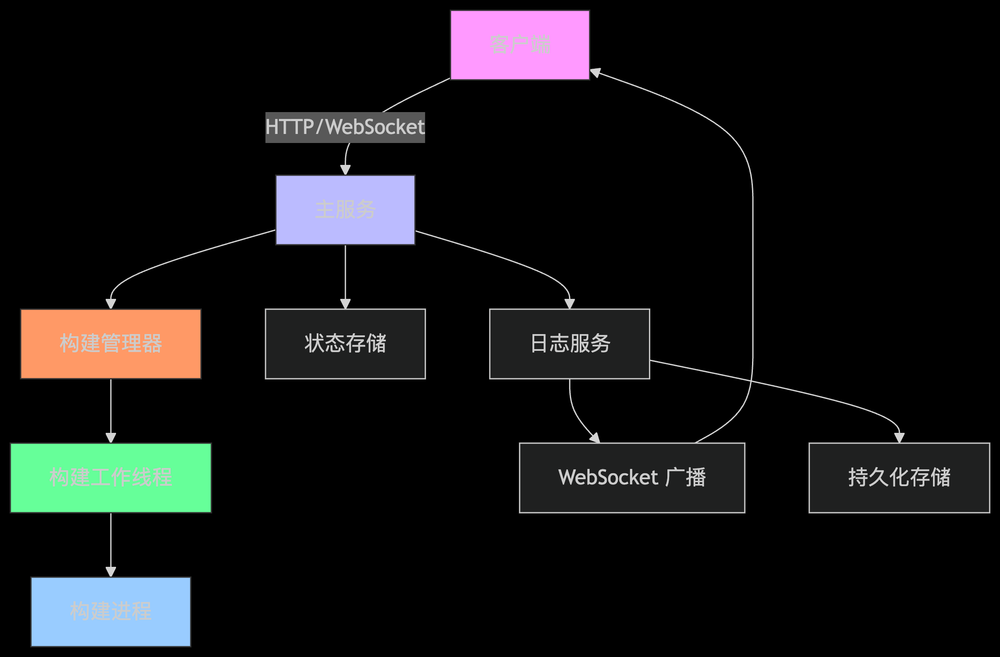
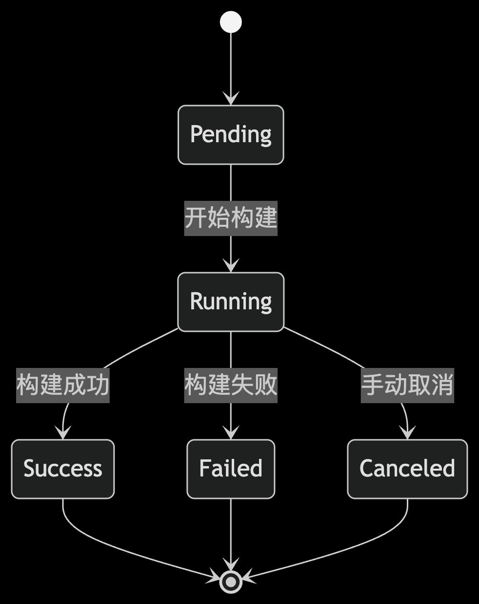
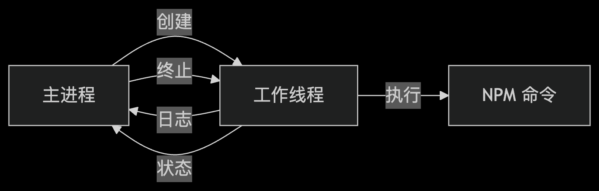
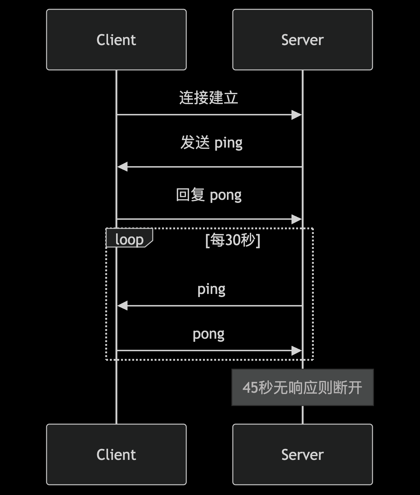
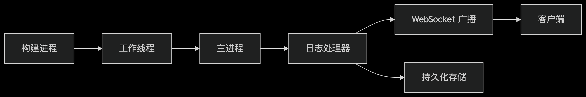

# Node.js CI/CD 服务系统文档

## 目录

- 系统概述

- 架构设计

- 核心功能

  - 构建任务状态管理

  - 子进程隔离构建任务

  - WebSocket 增强服务

  - 实时构建日志

  - CI/CD 集成

- 部署指南

- 使用示例

- API 参考

- 扩展规划

## 系统概述
>
> Node.js CI/CD 服务是一个专为前端项目设计的持续集成和部署系统，提供以下核心能力：

- 🚀 一键式构建部署：支持本地和远程触发构建

- 🔒 构建隔离：使用子进程隔离构建任务，防止构建失败影响主服务

- 📊 实时日志：通过 WebSocket 实时传输构建日志

- 🔄 状态管理：完善的构建状态管理和并发控制

- 🔔 通知系统：支持多种通知渠道（钉钉、微信等）

- ⚙️ 环境管理：支持多环境（dev/staging/prod）配置

## 架构设计



组件说明：

- 主服务：HTTP API 入口和 WebSocket 服务

- 构建管理器：负责创建、管理和监控构建任务

- 构建工作线程：在独立进程中执行构建任务

- 状态存储：跟踪构建状态和项目锁

- 日志服务：收集、广播和存储构建日志

## 核心功能

- 构建任务状态管理

- 状态流转图



关键特性：

- 项目构建锁：每个项目同一时间只允许一个运行中的构建

- 状态持久化：构建状态存储在内存中（可扩展为数据库）

- 并发控制：限制系统整体并发构建数量

- 取消支持：可手动取消进行中的构建

- 状态说明:

| 状态         | 描述   |
| ---------- | ---- |
| `Pending`    | 构建已创建但尚未开始执行 |
| `Running` | 构建正在执行中   |
| `Success` | 构建成功完成   |
| `Failed` | 构建失败   |
| `Canceled` | 构建被手动取消   |

## 子进程隔离构建任务



关键优势：

- 错误隔离：构建进程崩溃不会影响主服务

- 资源控制：可限制 CPU/内存使用

- 安全沙箱：限制环境变量和系统访问

- 独立生命周期：构建进程可独立于请求存在

## WebSocket 服务
>
> 心跳机制实现



功能特点：

- 心跳检测：30秒间隔，45秒超时断开

- 连接管理：每个连接唯一ID跟踪

- 频道订阅：按构建ID分组广播

- 错误处理：自动重连机制

- 流量控制：限制消息大小(1MB/消息)

## 实时构建日志



功能特点：

- 实时传输：毫秒级日志延迟

- 多路输出：同时支持控制台和WebSocket

- 日志分级：区分 stdout/stderr

- 持久化存储：自动压缩归档旧日志

- 格式统一：标准化日志格式包含元数据

```ts

interface LogEntry {
  buildId: string;
  type: 'log' | 'error' | 'warning' | 'info';
  data: string;
  stream?: 'stdout' | 'stderr';
  timestamp: string;
  stage?: string; // 构建阶段
}

```

## 扩展规划

> 短期优化

- 持久化存储：集成 Redis/Mysql 存储构建状态

- 分布式构建：支持多构建节点负载均衡

- 审计日志：记录所有操作历史

- 资源监控：构建资源使用统计

> 中期规划

- 容器化构建：支持 Docker 环境构建

- 流水线配置：可视化流水线编辑器

- 安全扫描：集成代码安全扫描工具

> 长期愿景

- 插件系统：可扩展功能插件

## QA

通过此文档，您可以全面了解 Node.js CI/CD 服务的设计理念、功能特性和使用方法。系统将持续迭代，为开发团队提供更高效可靠的持续集成和部署体验。
